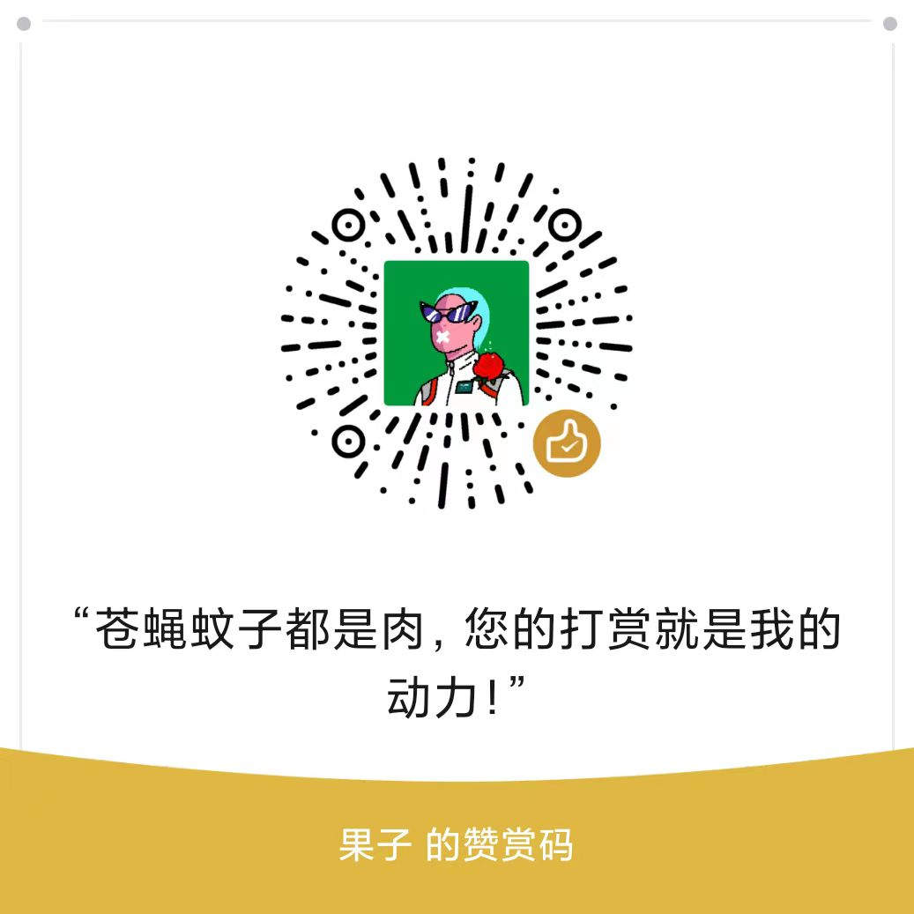

# zui-svg-icon

一款适用于 uni-app 的 SVG 图标组件。

**解决了 uni-app 在 APP 端中无法使用 SVG标签的问题**，在拉齐SVG图标显示问题的同时还支持单色图标换色、多色SVG图标显示、多色SVG图标换色。

使用简单：

```html
<!-- 单色图标 -->
<zui-svg-icon icon="doc" color="#FF0000" />
<!-- 多色图标 -->
<zui-svg-icon icon="doc" :color="['#FF0000', '#00FF00', '#0000FF']" />
```


## 🐲 特色

- 图标换色
- 多色图标
- 自带优化SVG优化工具


## 📝 TODO

- [ ] 增加 VUE3 支持

- [ ] 增加微信小程序支持(未测试,理论上直接使用没问题)


## 🎨 SVG 图标设计

### 🤍 单色图标

正常设计导出即可。


### ❤️‍🔥 多色图标

如果多色图标有改色需求，则在制作的时候需要人为控制颜色在SVG文件中出现的顺序，以确保图标的更新对代码的影响减至最小。

#### 为什么需要控制颜色的顺序

在SVG图像中，位于最底层的元素，其对应的节点描述最先出现在SVG文件里，这就决定了组件在获取颜色序列时，最底层元素的颜色始终第一位。

由于设计师在图标的设计、修改过程中，设计元素的层级顺序会变化，这将导致颜色顺序无法固定。每次修改图标都可能需要更新代码里的配色顺序。这个问题在有一系列图标时尤为明显。

#### 如何控制颜色顺序

在SVG图标最底层，人为设置一组元素，将图标里使用到的颜色逻列出来即可。

注意点：

1. 元素必须使用上层可见元素去遮挡，设置透明度为0会导致元素被优化掉从而失去；
2. 使用填充定义颜色，边框设置会被忽略；


## 🏭 SVG 图标生成

使用专用脚本生成 SVG 图标库。


### 1️⃣ 生成步骤

1. 将 SVG 图标复制到 **图标保存位置**
2. 运行脚本 `node /{path-to-script}/generate-svg-icon.js`
3. 结束！

脚本会生成图标库时会保持和目录里的图标一致。

生成脚本运行时会生成报告，显示图标的ID及状态（新增，修改与删除）。如果是多色图标还会显示对应的颜色序列。

```shell
Add    ppt
       [ '#f2733d', '#f3b2a6', '#fff' ]
Update xls
       [ '#47b347', '#e0efdc' ]
Total 2 svg icon(s) generated, 1 added, 0 deleted.
```


### 🤖 添加脚本

如果使用 npm 管理项目，可以在 package.json 中添加一个脚本以方便调用。

` "svgicon": "node ./uni_modules/zui-svg-icon/tools/generate-svg-icon.js",`

**PS: 文件路径根据实际情况调整**

使用：

`npm run svgicon`


### 🗄️ 文件位置说明

#### SVG图标位置：

`/static/svg-icons/`

#### 脚本位置：

`/uni_modules/zui-svg-icon/tools/generate-svg-icon.js`

#### 图标库位置：

`/static/svg-icons/svg-icons-lib.js`


## 💎 支持

不爱咖啡☕️，来瓶肥宅快乐水🥤吧！



